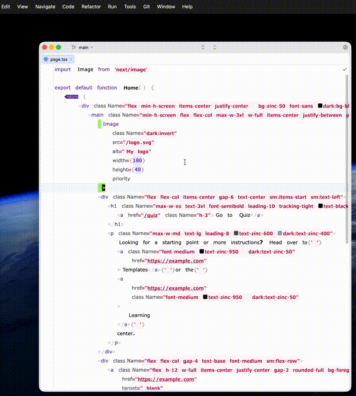
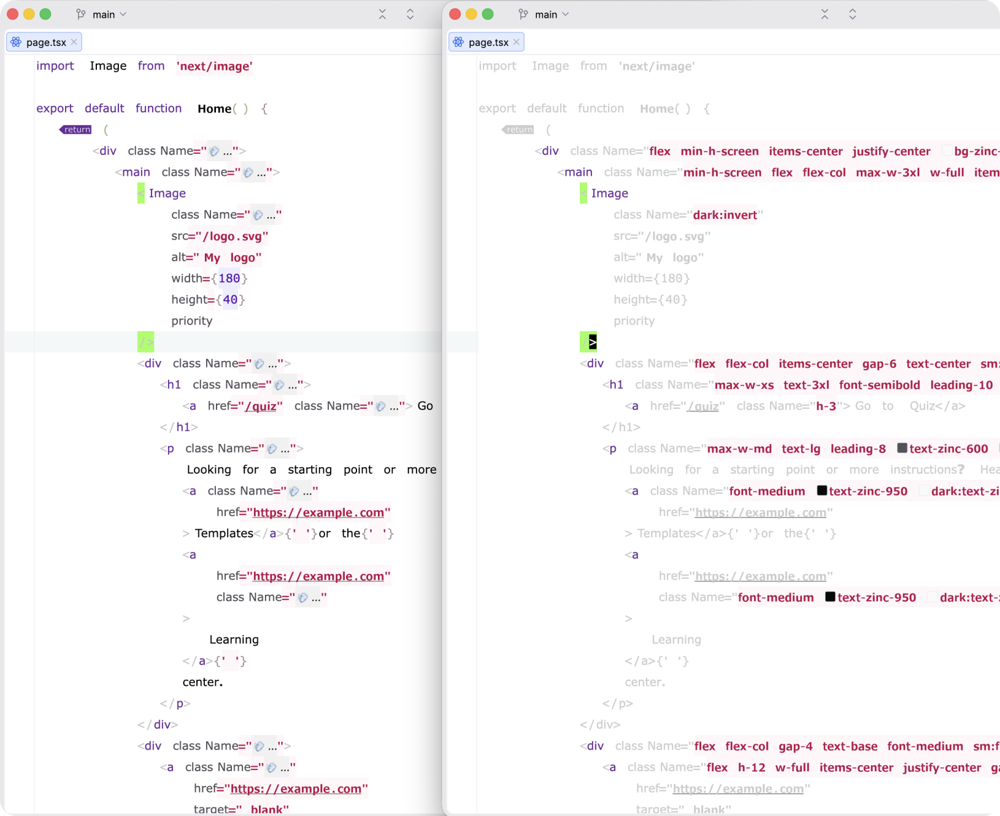
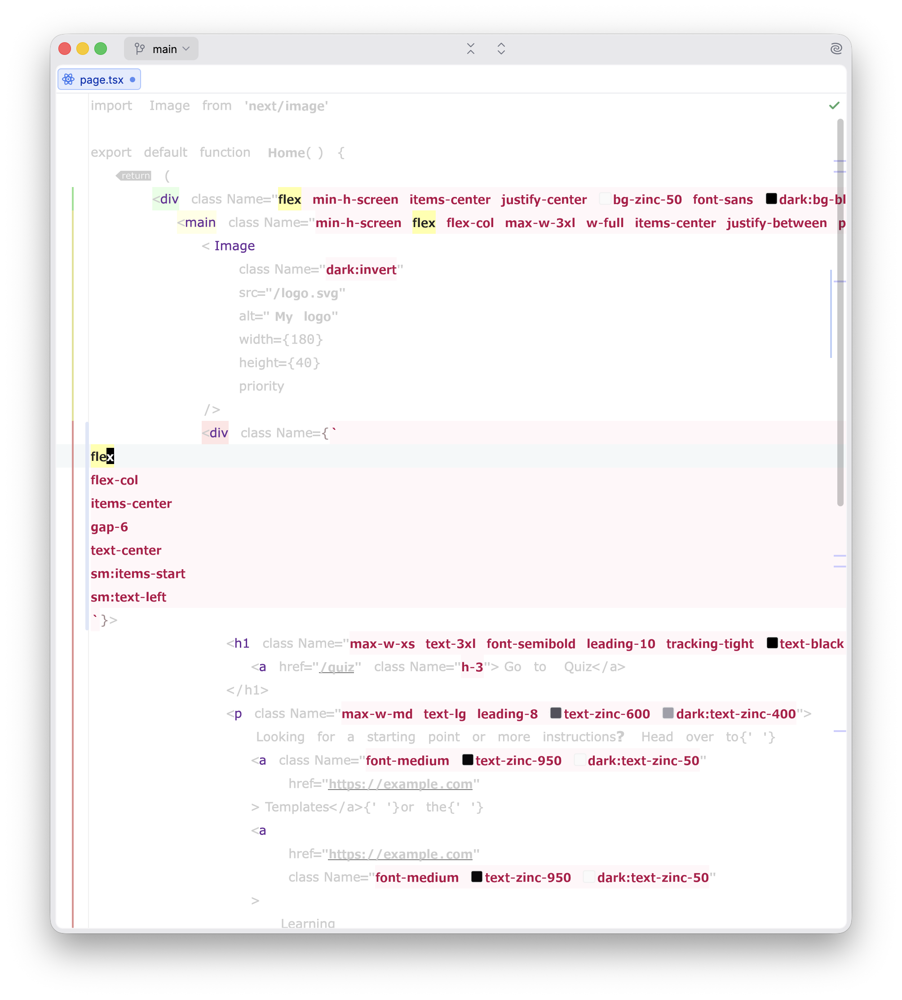
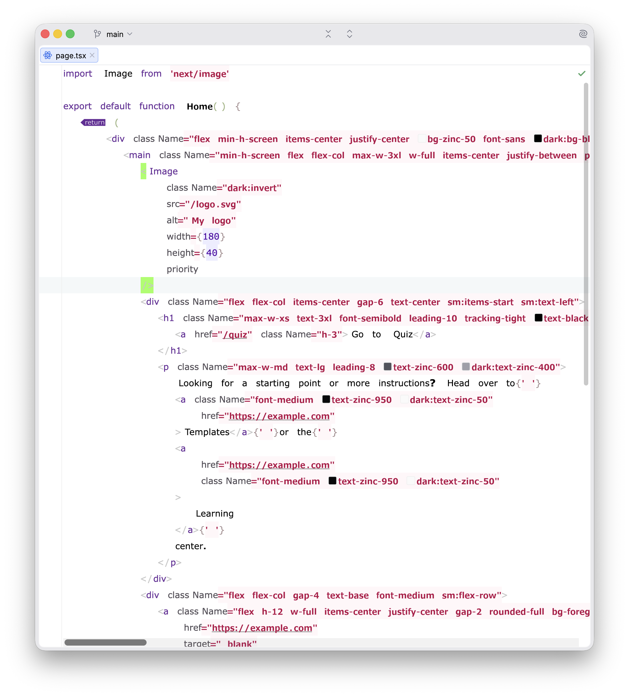

# Tailwind Eye

https://plugins.jetbrains.com/plugin/31444-tailwind-eye

A WebStorm extension that provides a visual fading or folding effect for code. It can toggle between fading non-styling
code (to focus on Tailwind classes) and folding the content of `className` strings.

## Demo


## Fold and Dim


## Edit multiline


## Off



## Motivation
To reduce visual noise and focus on what matters, whether it's the structure of your HTML/JSX or the Tailwind styling
itself.

<!-- Plugin description -->
Use the shortcut `Shift + Alt + F` to toggle between the two modes:
- **Fade non-styling code**: Fades everything except `className` attributes.
- **Fold className content**: Folds the actual Tailwind utility strings.

`Cmd+Shift+I` toggles inline<->multiline classNames

<!-- Plugin description end -->


## Development

```sh
./gradlew runIde
```

```sh
./gradlew buildPlugin
```
The resulting ZIP:
`build/distributions/tailwind-eye-1.0-SNAPSHOT.zip`
